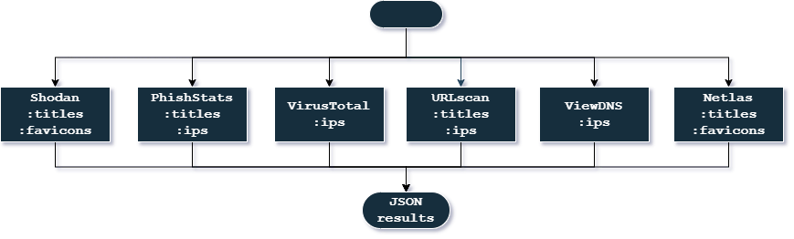

# Target scouter

## The tool is designed for targeted exploration of similar brand resources

### Algorithm:


### Search by:
* favicons hashes (mmh3, sha256);
* ips;
* \<title\> keywords;

## Retrieves data from resources:
|                                            Resource                                            |  API limits  |
|:----------------------------------------------------------------------------------------------:|:------------:|
|                                [Shodan](https://www.shodan.io/)                                |      *       |
|                                 [URLscan](https://urlscan.io/)                                 |      *       |
|                             [PhishStats](https://phishstats.info/)                             |      *       |
|                                  [Netlas](https://netlas.io/)                                  | daily limits ||


#### Add API keys for working with resources in the file `src/config.py`
### 1. Set up rules for companies
To get favicons hashes, you can put them in `src/settings/favicons` and run.

Fill in the rules in `src/settings/settings.yaml`:
```yaml
favicons:
  sha256hash: ["<STR: sha256 hash favicon>", ...]
  murmurhash: [<mmh3 hash favicon>, ...]

keywords:
  title: ["<title keyword>", ...]

ips:
  ips: ["<ip>", ...]
  enable: False
```
### 2. Run `src/main.py `
The results are written in JSON format to the file `data/results.json`. Search for indicators for the last month.

### _Good luck friend!_